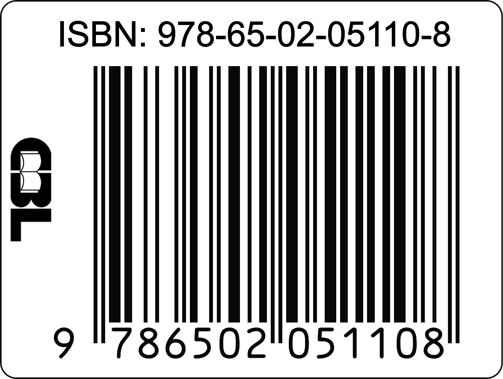

## Autor

**Henrique Alvarenga da Silva**

Médico psiquiatra. Professor de Psiquiatria e Psicopatologia no curso de Medicina da Universidade Federal de São João del-Rei (UFSJ). Professor de Métodos de Pesquisa em Medicina na UNIPTAN/AFYA.

🌐 [henriquealvarenga.com](https://www.henriquealvarenga.com)

📧 [henriquealvarenga\@ufsj.edu.br](mailto:henriquealvarenga@ufsj.edu.br)

🆔 ORCID: [0000-0001-9799-5240](https://orcid.org/0000-0001-9799-5240)

## Sobre a obra

Este material foi desenvolvido como recurso educacional para estudantes de medicina, residentes e profissionais da área da saúde que desejam compreender os fundamentos da classificação e organização de dados em pesquisa. O conteúdo abrange desde a definição de variáveis e escalas de medida até a publicação de dados segundo princípios de ciência aberta.

## Tecnologias utilizadas

Este material foi produzido utilizando ferramentas de código aberto e ciência aberta:

| Tecnologia | Finalidade |
|----------------------------------|--------------------------------------|
| [R](https://www.r-project.org/) | Linguagem de programação estatística |
| [Quarto](https://quarto.org/) | Sistema de publicação científica e técnica |
| [Markdown](https://www.markdownguide.org/) | Linguagem de marcação para escrita do conteúdo |
| [Positron](https://github.com/posit-dev/positron) | Ambiente de desenvolvimento integrado (IDE) |
| [Git](https://git-scm.com/) | Controle de versão |
| [GitHub](https://github.com/) | Hospedagem do repositório e controle de versão |
| [GitHub Pages](https://pages.github.com/) | Publicação e hospedagem do site |
| [BibTeX](http://www.bibtex.org/) | Gerenciamento de referências bibliográficas |

### Inteligência artificial

O desenvolvimento deste material contou com o auxílio de ferramentas de inteligência artificial generativa:

-   **Claude** (Anthropic) — assistência na estruturação do conteúdo, geração de código R, revisão textual e organização das referências
-   **ChatGPT** (OpenAI) — apoio na elaboração de seções específicas e revisão de conteúdo

O uso dessas ferramentas seguiu princípios de transparência e verificação: todo o conteúdo gerado foi revisado, verificado e validado pelo autor. As referências bibliográficas foram conferidas individualmente para garantir precisão e veracidade.

::: callout-note
## Nota sobre o uso de IA

A inteligência artificial foi utilizada como ferramenta de apoio, não como substituto do trabalho intelectual. A responsabilidade pelo conteúdo final, incluindo a precisão das informações, do código e a adequação das referências, é integralmente do autor.
:::

## Repositório

O código-fonte deste projeto está disponível publicamente:

🔗 **Repositório:** [github.com/henriquealvarenga/tiposdedados](https://github.com/henriquealvarenga/tiposdedados)

Contribuições, sugestões e correções são bem-vindas por meio de *issues* ou *pull requests*.

## Outros projetos do autor

-   [Dos Dados aos Gráficos](www.henriquealvarenga.com/graficos) — Visualização Estatística para Profissionais de Saúde    
-   [Revisões de Literatura em Saúde](www.henriquealvarenga/Literature_Review)   
-   [GitHub Manual](www.henriquealvarenga.com/github_manual)   
-   [Manual Basico da Linguagem R](www.henriquealvarenga.com/manual_r)   

## Licença

Este trabalho está licenciado sob uma Licença **Creative Commons Atribuição-NãoComercial-CompartilhaIgual 4.0 Internacional (CC BY-NC-SA 4.0)**.

Você tem o direito de:

-   **Compartilhar** — copiar e redistribuir o material em qualquer suporte ou formato
-   **Adaptar** — remixar, transformar e criar a partir do material

Sob os seguintes termos:

-   **Atribuição** — Você deve dar o crédito apropriado, fornecer um link para a licença e indicar se mudanças foram feitas
-   **NãoComercial** — Você não pode usar o material para fins comerciais
-   **CompartilhaIgual** — Se você remixar, transformar ou criar a partir do material, deve distribuir suas contribuições sob a mesma licença

🔗 [Texto completo da licença](https://creativecommons.org/licenses/by-nc-sa/4.0/deed.pt_BR)

## Citação

Selecione o formato desejado e clique em **Copiar** para copiar a citação:

```{=html}
<div style="margin: 1.5em 0;">
  <div style="display: flex; gap: 8px; margin-bottom: 12px; flex-wrap: wrap;">
    <button onclick="showCitation('abnt')" id="btn-abnt" style="padding: 8px 18px; border: 2px solid #3B82F6; background: #3B82F6; color: white; border-radius: 6px; cursor: pointer; font-weight: 600; font-size: 0.9em;">ABNT</button>
    <button onclick="showCitation('vancouver')" id="btn-vancouver" style="padding: 8px 18px; border: 2px solid #3B82F6; background: white; color: #3B82F6; border-radius: 6px; cursor: pointer; font-weight: 600; font-size: 0.9em;">Vancouver</button>
    <button onclick="showCitation('apa')" id="btn-apa" style="padding: 8px 18px; border: 2px solid #3B82F6; background: white; color: #3B82F6; border-radius: 6px; cursor: pointer; font-weight: 600; font-size: 0.9em;">APA 7ª ed.</button>
    <button onclick="showCitation('bibtex')" id="btn-bibtex" style="padding: 8px 18px; border: 2px solid #3B82F6; background: white; color: #3B82F6; border-radius: 6px; cursor: pointer; font-weight: 600; font-size: 0.9em;">BibTeX</button>
  </div>
  <div id="citation-box" style="background: #f8f9fa; border: 1px solid #dee2e6; border-radius: 8px; padding: 16px; font-family: 'SFMono-Regular', Consolas, 'Liberation Mono', Menlo, monospace; font-size: 0.85em; line-height: 1.6; white-space: pre-wrap; min-height: 60px;">SILVA, Henrique Alvarenga da. <b>Tipos de Dados em Saúde</b>: Da Coleta à Análise. Publicação independente, 2026. ISBN 978-65-02-05110-8. Disponível em: https://henriquealvarenga.com/tiposdedados/</div>
  <button onclick="copyCitation()" id="btn-copy" style="margin-top: 10px; padding: 8px 20px; background: #10B981; color: white; border: none; border-radius: 6px; cursor: pointer; font-weight: 600; font-size: 0.9em;">📋 Copiar</button>
  <span id="copy-msg" style="margin-left: 10px; color: #10B981; font-weight: 600; display: none;">Copiado!</span>
</div>

<script>
const citations = {
  abnt: 'SILVA, Henrique Alvarenga da. <b>Tipos de Dados em Saúde</b>: Da Coleta à Análise. Publicação independente, 2026. ISBN 978-65-02-05110-8. Disponível em: https://henriquealvarenga.com/tiposdedados/',
  vancouver: 'Silva HA. Tipos de dados em saúde: da coleta à análise [Internet]. Publicação independente; 2026 [cited ' + new Date().getFullYear() + ']. ISBN 978-65-02-05110-8. Available from: https://henriquealvarenga.com/tiposdedados/',
  apa: 'Silva, H. A. (2026). <i>Tipos de dados em saúde: Da coleta à análise</i>. Publicação independente. ISBN 978-65-02-05110-8. https://henriquealvarenga.com/tiposdedados/',
  bibtex: `@book{silva2026tiposdedados,
  author    = {Silva, Henrique Alvarenga da},
  title     = {Tipos de Dados em Saúde: Da Coleta à Análise},
  year      = {2026},
  publisher = {Publicação independente},
  isbn      = {978-65-02-05110-8},
  url       = {https://henriquealvarenga.com/tiposdedados/},
  note      = {Recurso educacional aberto}
}`
};

const citationsPlain = {
  abnt: 'SILVA, Henrique Alvarenga da. Tipos de Dados em Saúde: Da Coleta à Análise. Publicação independente, 2026. ISBN 978-65-02-05110-8. Disponível em: https://henriquealvarenga.com/tiposdedados/',
  vancouver: 'Silva HA. Tipos de dados em saúde: da coleta à análise [Internet]. Publicação independente; 2026 [cited ' + new Date().getFullYear() + ']. ISBN 978-65-02-05110-8. Available from: https://henriquealvarenga.com/tiposdedados/',
  apa: 'Silva, H. A. (2026). Tipos de dados em saúde: Da coleta à análise. Publicação independente. ISBN 978-65-02-05110-8. https://henriquealvarenga.com/tiposdedados/',
  bibtex: citations.bibtex
};

let currentFormat = 'abnt';

function showCitation(format) {
  currentFormat = format;
  document.getElementById('citation-box').innerHTML = citations[format];
  ['abnt','vancouver','apa','bibtex'].forEach(f => {
    const btn = document.getElementById('btn-' + f);
    if (f === format) {
      btn.style.background = '#3B82F6';
      btn.style.color = 'white';
    } else {
      btn.style.background = 'white';
      btn.style.color = '#3B82F6';
    }
  });
  document.getElementById('copy-msg').style.display = 'none';
}

function copyCitation() {
  const text = citationsPlain[currentFormat];
  navigator.clipboard.writeText(text).then(() => {
    const msg = document.getElementById('copy-msg');
    msg.style.display = 'inline';
    setTimeout(() => { msg.style.display = 'none'; }, 2000);
  });
}
</script>
```

## ISBN

::: {.callout-note title="ISBN: 978-65-02-05110-8" icon=false}



:::

## Ficha catalográfica

::: {.callout-note title="Ficha Catalográfica" icon=false}
*Ficha catalográfica será incluída após elaboração.*

<!-- Substituir pela imagem da ficha quando disponível:

-->
:::

## Agradecimentos

Agradeço aos estudantes e colegas que, ao longo dos anos, motivaram a criação deste material com suas dúvidas, sugestões e entusiasmo pela pesquisa científica e pela compreensão dos dados em saúde.

## Histórico de versões

| Versão | Data        | Descrição      |
|--------|-------------|----------------|
| 1.0.0  | Março/2026  | Versão inicial |

## Contato

Dúvidas, sugestões ou correções podem ser enviadas para:

📧 [henriquealvarenga\@ufsj.edu.br](mailto:henriquealvarenga@ufsj.edu.br)

Ou por meio de *issues* no repositório do projeto no GitHub.

------------------------------------------------------------------------

*Última atualização: Março de 2026*
