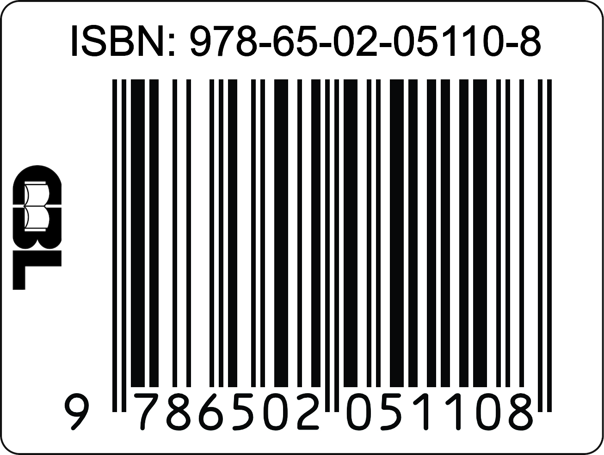

<!-- Página de créditos do livro. Junto com a capa (página de rosto), é o que
     a CBL usa para montar a ficha catalográfica: título e subtítulo devem
     ficar exatamente como no registro do ISBN. -->

::: {.creditos}

[Tipos de Dados em Saúde]{.creditos-titulo}\
[Da Coleta à Análise]{.creditos-subtitulo}

Henrique Alvarenga da Silva

© 2026 Henrique Alvarenga da Silva

Edição do Autor\
São João del-Rei, MG\
2026

Livro eletrônico (HTML)\
<https://henriquealvarenga.com/tiposdedados/>

ISBN 978-65-02-05110-8

{width=220px fig-align="center" fig-alt="Código de barras do ISBN 978-65-02-05110-8"}

<!-- A ficha catalográfica (CIP) entra aqui quando a CBL enviar a versão
     corrigida. -->

[Esta obra está licenciada sob a Licença Creative Commons Atribuição-NãoComercial-CompartilhaIgual 4.0 Internacional ([CC BY-NC-SA 4.0](https://creativecommons.org/licenses/by-nc-sa/4.0/deed.pt_BR)).]{.creditos-licenca}

:::
